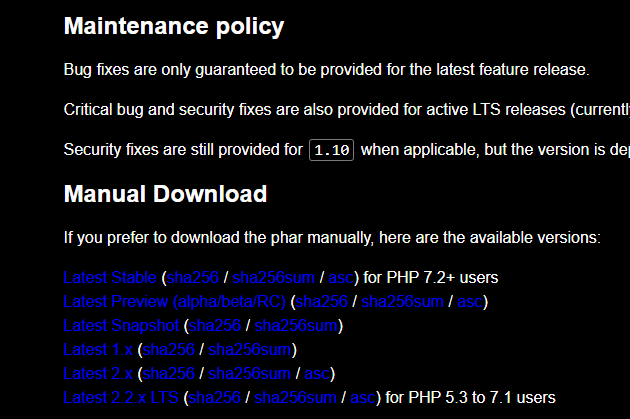

# Resolución de Tickets

#### A continuación, se detalla paso a paso cómo copiar y pegar el sistema, además de verificar y probar que cada ticket funcione correctamente. También se incluyen imágenes de referencia.

---

## Requisitos

1. **Descargar Composer**  
   Antes de comenzar, asegúrate de descargar Composer:  
   [Click aquí para descargar](https://getcomposer.org/download/)

   Al abrir el enlace, verás una página como esta:  
   

   Click en "latest stable" y el archivo se descargará automáticamente.

   > ⚠️ **Asegúrate de que se haya descargado en la carpeta "Descargas" para evitar errores.**

2. **Configurar las variables de entorno**  
   - Haz click derecho en el archivo descargado y selecciona "Propiedades".  
   - Verás una ventana similar a esta:  
       
   - Copia la ruta que aparece en la sección "Ubicación".  
   - A continuación, presiona la tecla Windows y busca "Editar variables de entorno". Abre la ventana que se ve así:  
       
   - En la ventana que aparece, selecciona "Variables de entorno". Verás la siguiente imagen:  
       
   - Selecciona "Path" y haz click en "Editar". **Realiza esto tanto en las variables del sistema como en las del usuario.**
   - Haz click en "Nuevo" y pega la dirección copiada anteriormente.  
       
   - Acepta todos los cambios y cierra las ventanas.

---

## Importar la base de datos

1. Abre **PhpMyAdmin** y crea una nueva base de datos.  
   > **Es necesario tener iniciado XAMPP con MySQL y Apache.**

   

2. Poner el nombre exactamente como se muestra en la imagen y crea la base de datos (no es necesario crear tablas):  
   

3. Ve a la pestaña **Importar**:  
   

4. Selecciona el archivo SQL que se encuentra en la carpeta "sql" del repositorio descargado de GitHub.  
   

5. Haz click en "Importar".  
   > **Es normal que aparezca un error indicando que una tabla ya existe. Puedes ignorarlo.**

6. Ve a la tabla **carteles** y haz click en "Insertar".  
   

7. Rellena los campos con cualquier valor, excepto el campo **AGENDA**, donde debes poner "Ayuda" (con la inicial en mayúscula).  
   

8. Haz click en "Continuar" y habrás completado este paso.

---

## 3.2

- Apuntar a las URL's de los CDN de internet para todos los archivos necesarios (Bootstrap, JS, etc.).
- Eliminar los archivos innecesarios del directorio Bootstrap en la raíz del sitio.

_Este paso ya está realizado en el código, no es necesario hacer nada más._

---

## 3.3

- Personalizar la aplicación con tu nombre y agregar un logo en el menú.

1. Abre el archivo `menu_bs.php`, presiona **Ctrl + F** y busca "mariano".  
2. Reemplaza "mariano" con tu nombre.  
   

---

## 3.4

- Unificar el archivo `config.php` para que los datos de conexión a MySQL se encuentren en un único archivo.

_Este paso también está realizado en el código._

---

## 3.5

- Agregar dos nuevos diseños a las plantillas de la cartelera.

1. Inicia sesión con el usuario "lp" y la contraseña **1234**:  
   

2. Ve a **Cartelera** y selecciona las distintas plantillas. Es lo que se pide mostrar:  
   

---

## 3.6

- Agregar al menú público una nueva opción **"Ayuda"** y una nueva categoría de carteles **"Ayuda"** que solo se cargan al acceder a dicha opción.

1. En el archivo `menu_bs.php`, dirígete a la sección donde se encuentra la barra de navegación:  
   

2. La línea de código que se agregó es la siguiente:  
   

3. Ve a la opción **"Ayuda"** y debería aparecer algo similar a esto:  
   

---

## 3.7

- Agregar la posibilidad de vista previa para audios y videos en la sección de publicaciones digitales.

1. Descarga un video en formato **MP4** y un audio en formato **MP3**.  
2. Ve a **Libros digitales** y haz click en el botón **"Alta"**:  
   

3. Rellena los campos con el nombre, título, autor, etc.  
4. En el campo **tipo**, selecciona **video** o **audiotexto** según corresponda.  
5. Sube el archivo guardado en la carpeta `libros_d`:  
   

6. Haz click en **Agregar**.  
7. Para ver el resultado, ve a la pestaña **Buscar**, encuentra tu video o audio y haz click en el botón **min**:  
   

---

## 3.8

- Agregar la opción de material impreso (libros) y la posibilidad de controlar los préstamos a los socios de la biblioteca.

**Este paso está pendiente. Si alguien sabe cómo hacerlo, por favor avísame. ¡Gracias!**

---

## 3.9

- Agregar en la pantalla del administrador un indicador en tiempo real de los usuarios que hayan iniciado sesión (utilizando websockets).

1. Abre el archivo `server.php`, presiona **Ctrl + Shift + P** para abrir una terminal.  
2. En la terminal, escribe el siguiente comando:  
   

3. Presiona **Enter** y recarga la página.  
4. Si el contador aparece como uno, abre otra pestaña de la página para ver cómo se suma otro usuario conectado:  
   

---

## Eso es todo

Si algo no funciona, por favor avísenme. Si hay que cambiar algo, lo haré saber por el grupo y actualizaré este README.  
Si todo funciona correctamente, ¡agradezco que alguien me compre algo! ❤️❤️
